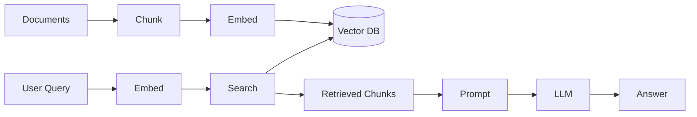

# RAG Architecture & Chunking Checklist

## Chunking decision checklist
- [ ] Chunk size fits comfortably under the embedding model's input limit
- [ ] Chunk boundaries respect semantic units (paragraph/section, not mid-sentence)
- [ ] Overlap (10-20%) added to avoid losing boundary context
- [ ] Metadata (source, date, section) stored alongside each chunk
- [ ] Re-indexing plan exists for when source documents change
