<div align="center">

# 🚀 Generative AI Engineering Lab

### Build it from scratch → Understand it deeply → Ship it to production

A structured, hands-on curriculum for engineers who want to understand **how generative AI actually works** — not just how to call an API.

[](#-course-roadmap)
[](#-getting-started)
[](https://platform.openai.com/)
[](https://github.com/panteamkhh/llm-engineering-lab/commits/main)
[](https://github.com/panteamkhh/llm-engineering-lab/stargazers)

</div>

---

## 📖 Table of Contents

- [What is this?](#-what-is-this)
- [Learning Philosophy](#-learning-philosophy)
- [Course Roadmap](#-course-roadmap)
- [How Each Lesson Works](#-how-each-lesson-works)
- [Repository Architecture](#-repository-architecture)
- [Getting Started](#-getting-started)
- [Tech Stack](#-tech-stack)
- [What Makes This Different](#-what-makes-this-different)
- [Contributing](#-contributing)

---

## 🎯 What is this?

A structured learning path that teaches **how Generative AI actually works** by building everything from scratch first — before reaching for a framework or SDK.

Each lesson follows the same rhythm: understand the problem, build the mechanism by hand in pure Python, then re-implement it with real production APIs and ship a reusable artifact.

---

## 🧭 Learning Philosophy

<div align="center">

### 🧠 Build It → 🔍 Understand It → ⚙️ Use It → 🚀 Ship It

</div>

> You don't really understand a system until you've built a small version of it yourself.

---

## 📚 Course Roadmap

| #  | Lesson | Focus |
|:--:|--------|-------|
| 01 | [Foundations of LLMs](https://github.com/panteamkhh/llm-engineering-lab/tree/main/01-foundations-of-generative-ai-and-llms) | Tokens, Transformers, model thinking |
| 02 | [Responsible AI](https://github.com/panteamkhh/llm-engineering-lab/tree/main/02-responsible-generative-ai) | Safety, risks, evaluation |
| 03 | [Prompt Engineering](https://github.com/panteamkhh/llm-engineering-lab/tree/main/03-prompt-engineering-fundamentals) | Prompt structure & patterns |
| 04 | [Advanced Prompting](https://github.com/panteamkhh/llm-engineering-lab/tree/main/04-advanced-prompt-engineering) | Injection, reasoning, structure |
| 05 | [Text Generation Apps](https://github.com/panteamkhh/llm-engineering-lab/tree/main/05-building-text-generation-apps) | Sampling, streaming |
| 06 | [Chat Applications](https://github.com/panteamkhh/llm-engineering-lab/tree/main/06-building-chat-applications) | Memory, context handling |
| 07 | [RAG Systems](https://github.com/panteamkhh/llm-engineering-lab/tree/main/07-search-apps-and-vector-databases) | Embeddings, vector DBs |
| 08 | [Image Generation](https://github.com/panteamkhh/llm-engineering-lab/tree/main/08-building-image-generation-apps) | Diffusion basics |
| 09 | [Tool Use & UX](https://github.com/panteamkhh/llm-engineering-lab/tree/main/09-low-code-function-calling-and-ux) | Function calling |
| 10 | [Agents & Security](https://github.com/panteamkhh/llm-engineering-lab/tree/main/10-security-lifecycle-agents-and-fine-tuning) | LLMOps, agents, safety |

### 🗺️ Learning Path

The curriculum flows through four phases — master each one before moving to the next.

```mermaid
flowchart LR
    subgraph P1["🧱 Foundations"]
        direction TB
        A1["01 · Foundations of LLMs"] --> A2["02 · Responsible AI"]
    end

    subgraph P2["✍️ Prompting"]
        direction TB
        B1["03 · Prompt Engineering"] --> B2["04 · Advanced Prompting"]
    end

    subgraph P3["🛠️ Building Applications"]
        direction TB
        C1["05 · Text Generation"] --> C2["06 · Chat Applications"]
        C2 --> C3["07 · RAG & Search"] --> C4["08 · Image Generation"]
    end

    subgraph P4["🚀 Production"]
        direction TB
        D1["09 · Function Calling & UX"] --> D2["10 · Agents & Security"]
    end

    A2 --> B1
    B2 --> C1
    C4 --> D1
```



---

## 🏗️ How Each Lesson Works

| Stage | Description |
|:-----:|-------------|
| 🧩 **Problem** | Why this matters in real systems |
| 🧠 **Concept** | Intuition before code |
| 🔨 **Build It** | From-scratch implementation (no SDK) |
| ⚡ **Use It** | Real API / framework version |
| 🚀 **Ship It** | Final reusable artifact |
| 🏋️ **Exercises** | Practice + challenge tasks |

---

## 📁 Repository Architecture

```text
LLM Engineering Lab
├── 01-foundations-of-generative-ai-and-llms/
│   ├── code/        # Runnable examples
│   ├── docs/        # Lesson write-up (en.md)
│   └── outputs/     # Reusable artifacts & checklists
├── 02-responsible-generative-ai/
├── 03-prompt-engineering-fundamentals/
├── 04-advanced-prompt-engineering/
├── 05-building-text-generation-apps/
├── 06-building-chat-applications/
├── 07-search-apps-and-vector-databases/
├── 08-building-image-generation-apps/
├── 09-low-code-function-calling-and-ux/
└── 10-security-lifecycle-agents-and-fine-tuning/
```

Every lesson ships with three things:

| Folder | Purpose |
|--------|---------|
| `code/` | From-scratch and real-API Python implementations |
| `docs/` | The full lesson narrative and explanation |
| `outputs/` | A production-oriented checklist, template, or reference |

---

## 🚀 Getting Started

**1. Clone the repository**

```bash
git clone https://github.com/panteamkhh/llm-engineering-lab.git
cd llm-engineering-lab
```

**2. Create a virtual environment and install dependencies**

```bash
python -m venv .venv
# Windows
.venv\Scripts\activate
# macOS / Linux
source .venv/bin/activate
```

**3. Set your API key**

```bash
# Windows (PowerShell)
$env:OPENAI_API_KEY="sk-..."
# macOS / Linux
export OPENAI_API_KEY="sk-..."
```

**4. Start with Lesson 01**

Open [`01-foundations-of-generative-ai-and-llms/docs/en.md`](https://github.com/panteamkhh/llm-engineering-lab/tree/main/01-foundations-of-generative-ai-and-llms) and work through it in order. Run the `code/` examples as you go.

> 💡 Each `code/` file is runnable on its own and lists its `pip install` requirements in the header comment.

---

## 🧰 Tech Stack

<div align="center">


</div>

---

## ✨ What Makes This Different

- **No passive learning** — every concept is implemented, not just explained
- **From scratch first** — understand the mechanism before using the framework
- **Real engineering thinking** — parameters, failure modes, cost, and safety
- **Production-oriented** — each lesson ends with a reusable artifact
- **Modular design** — lessons stand alone but compound into a system

---

## 🤝 Contributing

Found a bug, a clearer explanation, or an improved example? Issues and pull requests are welcome.

1. Fork the repository
2. Create a feature branch (`git checkout -b feature/improvement`)
3. Commit your changes (`git commit -m "Add improvement"`)
4. Open a pull request

---

<div align="center">

**Built for engineers who want to understand, not just consume.**

<sub>⭐ If this lab helps you, consider giving it a star.</sub>

</div>
